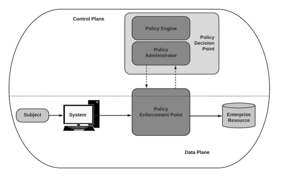
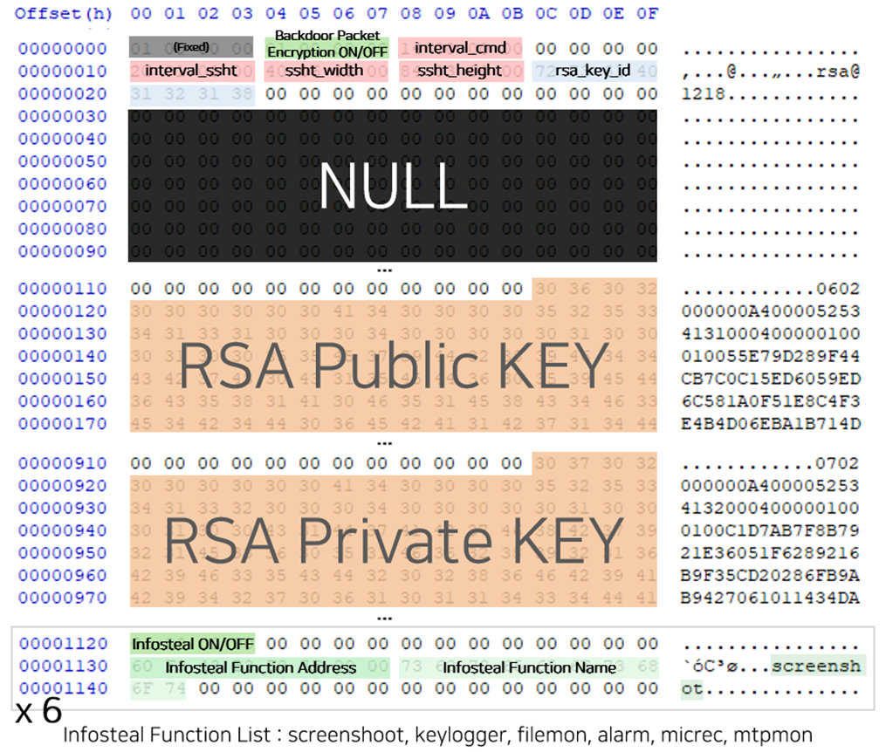
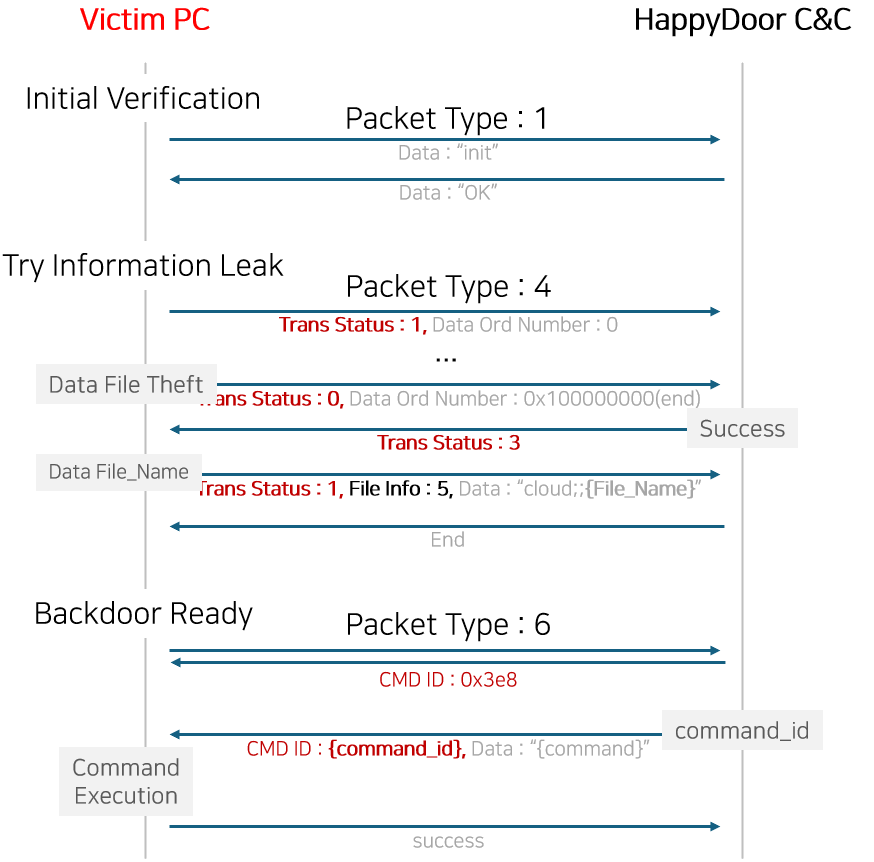

#### Don't be sad when you can be glad :)

North Koreas "Happy Door" malware has recently resurfaced and been updated according to security researchers. Although it isn't widely spread and not much action has been seen, it still has been actively used by the North Korean APT group `Kimsuky`. It has been dubbed `Happy Door` due to researchers finding the word `happy` in strings.



Like most malware it's first compressed in a email attachment. The compressed file is a JScript dropper which creates and runs `Happy Door`. It also fake bait file to throw people off.

```powershell
#Create and execute normal bait file
_Stream .SaveToFile (“C:\Windows\..\ProgramData\[Normal bait file ]”, “2”);
IWshShell3 .Run (“C:\Windows\..\ProgramData\[normal decoy file ]”, “”);

…(생耻)…
#HappyDoor 五合(certutil)
IWshShell3 .Run (“powershell.exe -windowstyle hidden certutil -decode C:\Windows\..\ProgramData\[ Base64Encoded_HappyDoor ] C:\Windows\..\ProgramData\[ HappyDoor ]”, “0”, “true”);

…(생략)…
#HappyDoor 실행
IWshShell3.Run(“powershell.exe -windowstyle hidden cmd /c cmd /c regsvr32.exe /s /n /i:syrsd* C:\Windows\..\ProgramData\[HappyDoor]“, “0”, “true”);
```

#### The fun stuff :D

`Happy Door` has 3 stages of execution
> Install*
1. Scheduler registration (“Intel\Disk\Volume0”)
2. Self-replication (specific path) and self-delete of existing files
3. Rerun with init*

```
schtasks /create /f /tn “Intel\Disk\Volume0” /tr “C:\Windows\system32\regsvr32.exe /s /n/i:init* ‘C:\Users\han\AppData\Roaming\Microsoft\Internet Explorer\LocalData\ imx.cfg” /sc minute /mo 5
```

This stage basically as you can see starts its persistence using the self replication and schedule registering.

> Init*
1. Self-replication (.otp) and re-run with run*

Taking from the install step it self replicates using the .otp extension

```
과거)
– %APPDATA%\microsoft\internet explorer\localdata\ie.cfg
– %APPDATA%\microsoft\internet explorer\localdata\ie.cfg.otp
 
현재)
– %APPDATA%\microsoft\internet explorer\localdata\imx.cfg
– %APPDATA%\microsoft\internet explorer\localdata\imx.cfg.otp
```

>Run*

1. Malware setting configuration (packet data + behavior information data)
2. Registry configuration
– Notepad: RSA key, malicious behavior-related data
– FTP: C&C address, packet verification data (USER ID)
3. System information (osi) and sample configuration information (gcfg) transmission
4. Malicious behavior thread creation (information theft / backdoor / data (klog, cmd) leak)

This is where the fun stuff starts. The main functions of `Happy Door` is the information stealing and backdooring. It uses RSA encryption to communicate with the C2 server and store all the configs in the registry.





While this isn't a complex malware or major concern at the moment, the updates and developments to the malware highlight NK's active use of it and it had a funny name :). 

Credits to Ahnlab for the graphics and research https://asec.ahnlab.com/ko/67128/